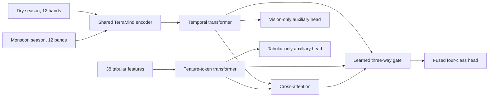

# Multimodal satellite and tabular experiment

## Model choice

Nilam uses `ibm-esa-geospatial/TerraMind-1.0-base` as its primary satellite encoder. TerraMind is a geospatial foundation model trained on the multimodal TerraMesh corpus, and the selected checkpoint accepts the complete 12-band Sentinel-2 L2A input rather than an RGB rendering. The base backbone has 87,313,920 parameters and a 768-dimensional representation. Frozen-backbone training followed by selective unfreezing of the final two blocks fits the 16 GB Apple M4 using batch size one and gradient accumulation.

Clay and Prithvi-EO were considered. Prithvi-EO-2.0-tiny is feasible, but TerraMind is the stronger match for the planned extension to Sentinel-1, DEM, and other aligned modalities. TerraMind Large was rejected for local training because its 3.8 GB weight file leaves insufficient headroom for stable activations and optimizer state on a 16 GB unified-memory system. TerraMind Tiny remains available as a fast ablation.

Sources:

- [TerraMind Base checkpoint and model card](https://huggingface.co/ibm-esa-geospatial/TerraMind-1.0-base)
- [TerraMind source](https://github.com/IBM/terramind)
- [TerraTorch TerraMind guide](https://github.com/torchgeo/terratorch/blob/main/docs/guide/terramind.md)

## Data unit

Each of the 1,400 statewide sample points receives:

- one 224 x 224 x 12 Sentinel-2 L2A dry-season composite for January through March;
- one 224 x 224 x 12 monsoon-season composite for June through September;
- the existing 38 terrain, climate, soil, hazard-reference, and accessibility variables;
- the existing four-class experimental weak label.

The composites use 2023 through 2025 imagery, the Sentinel-2 scene-classification layer to remove cloud, cloud shadow, cirrus, and snow, and a median temporal reducer. A chip covers about 2.24 km x 2.24 km at 10 m per output pixel. The files retain reflectance as compressed `uint16`; normalization uses the statistics published with TerraMind.

## Architecture



The shared vision encoder converts both seasons to patch tokens. Mean-pooled season representations pass through a temporal transformer. The validated statewide feature transformer supplies the tabular tokens and logits. Its weights remain frozen so multimodal training cannot destroy the stronger tabular baseline. Cross-attention lets satellite representations query projected tabular tokens. Layer-normalized vision, tabular, and cross-modal branches produce separate logits. A bounded learned gate mixes those logits, while a zero-initialized residual head learns corrections. This design starts close to the tabular baseline and prevents any branch from receiving exactly zero weight.

The fusion head is the primary output. Vision-only, frozen tabular-only, and cross-attention heads provide the required ablations. Reporting all four on the same held-out districts tests whether fusion adds information instead of merely increasing parameter count.

## Training and evaluation protocol

The district split is identical to the statewide tabular experiment:

- training: nine districts;
- validation: Ernakulam and Wayanad;
- test: Alappuzha, Idukki, and Kasaragod.

No sample from a held-out district is used to fit the tabular scaler, choose an epoch, or update weights. Stage one freezes TerraMind and trains the fusion modules. From epoch seven, only the final two TerraMind encoder blocks are unfrozen with a lower learning rate. Validation macro-F1 selects the checkpoint. Accuracy, macro-F1, log loss, confusion matrices, gate weights, and vision/tabular/fusion ablations are saved.

This experiment predicts the current rule-derived weak target. It can establish spatial generalization against that target and quantify the value of satellite imagery. It cannot validate residential construction safety. Expert-reviewed outcomes remain necessary for that claim.

## Reproduction

Create the dedicated Python 3.11 environment:

```bash
uv venv --python /opt/homebrew/bin/python3.11 .venv-multimodal
uv pip install --python .venv-multimodal/bin/python -r requirements-multimodal.txt
```

Download the chosen checkpoint:

```bash
hf download ibm-esa-geospatial/TerraMind-1.0-base \
  --include 'TerraMind_v1_base.pt' \
  --local-dir models/terramind-v1-base
```

Build the satellite dataset. The command is resumable and skips valid files already present:

```bash
PROJECT_ID=land-suitability-508903 \
.venv-multimodal/bin/python scripts/download_satellite_chips.py --workers 1
```

On macOS, use `--workers 1`. Concurrent native OpenSSL reads have caused interpreter crashes on the target machine. Completed `.npz` chips are atomic and the command resumes by skipping them.

Train the fused model:

```bash
PYTORCH_ENABLE_MPS_FALLBACK=1 \
.venv-multimodal/bin/python scripts/train_multimodal.py \
  --variant base \
  --checkpoint models/terramind-v1-base/TerraMind_v1_base.pt \
  --device mps --epochs 30 --batch-size 1 --accumulate 16
```

Outputs are written under `models/multimodal_v2/`: the best checkpoint, training history, and held-out evaluation. Raw chips and weights remain local and are ignored by Git. The original representation-level fusion is retained as a v1 ablation because its gate saturated on the vision branch during the first experiment.
